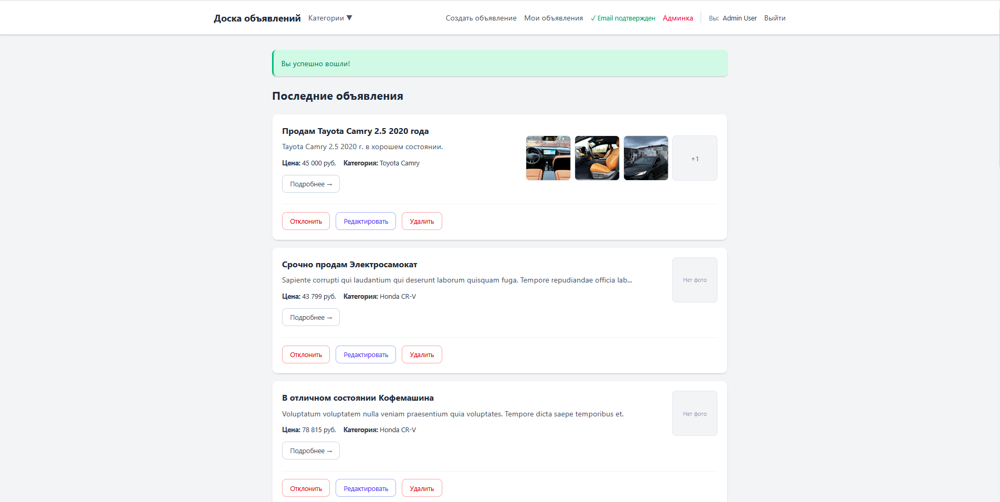
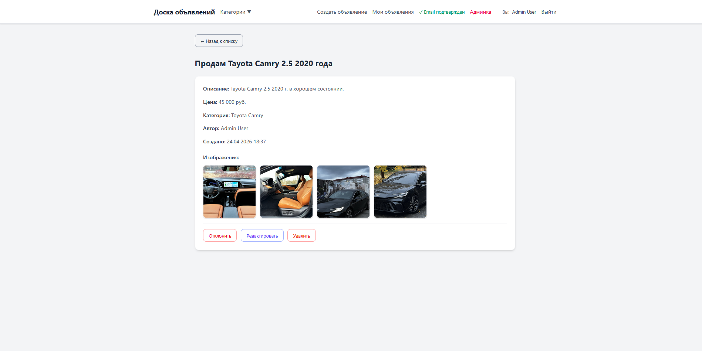
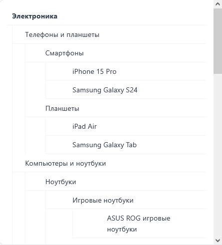
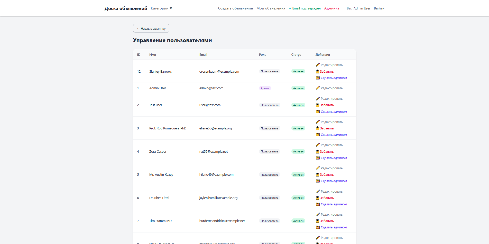

# 📢 Доска объявлений

## 📖 Описание проекта

Доска объявлений — это учебный проект интернет-площадки для размещения частных объявлений с полноценной системой управления пользователями, категориями и модерацией. Проект демонстрирует возможности Laravel в построении многоуровневых систем с ролевой моделью доступа(RBAC) и иерархическими категориями.

## 🚀 Основной функционал

### 👥 Пользователи и роли

- **Пользователь (User)** — может создавать объявления, редактировать и удалять свои, просматривать чужие
- **Администратор (Admin)** — полный доступ: управление пользователями (бан/разбан, назначение ролей), модерация объявлений

### 📝 Объявления

- Создание, редактирование, удаление объявлений
- Загрузка нескольких изображений (до 2MB на файл)
- Статусы: `pending` (на модерации), `approved` (одобрено), `rejected` (отклонено)
- Поля: заголовок, описание, цена (договорная / числовое значение)
- Дата создания

### 🗂️ Категории

- **Многоуровневая структура** (неограниченная вложенность)
- Пример: `Электроника → Телефоны и планшеты → Смартфоны → iPhone 15 Pro`
- Автоматический расчёт уровня вложенности (`level`)
- Отображение количества объявлений в категории (с учётом подкатегорий)
- Хлебные крошки (breadcrumbs) для навигации

### 🖼️ Изображения

- Поддержка нескольких изображений на объявление
- Хранение в `storage/app/public/advertisements`
- Превью в списках (до 3 фото, остальные — счётчиком)
- Автоматическое удаление файлов при удалении объявления

### 🛡️ Модерация

- Объявления создаются со статусом `approved` (сразу опубликованы)
- Администратор может:
  - Одобрить (`approved`)
  - Отклонить (`rejected`)
  - Отредактировать любое объявление
  - Удалить любое объявление


### 👑 Административная панель

- **Дашборд** — статистика (всего объявлений, активных, отклонённых, пользователей, забаненных)
- **Управление пользователями** — список, редактирование, бан/разбан, назначение ролей
- **Управление объявлениями** — список всех объявлений (пагинация 50), фильтрация, редактирование, одобрение/отклонение

## 🛠️ Технологический стек

| Технология | Назначение |
|:--- |:--- |
| **Laravel 12** | Современный PHP-фреймворк (Бэкенд) |
| **MySQL 8.0** | Реляционная база данных |
| **Tailwind CSS 4** | Новейший Utility-first CSS фреймворк |
| **Vite** | Быстрая сборка фронтенд-ресурсов |
| **Docker** | Контейнеризация и изоляция среды разработки |


## 🌟 Ключевые особенности

*   **🌳 Рекурсивная система категорий**: Поддержка неограниченной глубины вложенности. Реализовано через самоссылающиеся связи (**self-referencing relationships**) в Eloquent.
*   **🔐 Управление доступом (RBAC)**: Гибкая логика прав для разных типов пользователей: *Гости*, *Зарегистрированные пользователи* и *Администраторы*.
*   **📢 Управление объявлениями**: Полный цикл **CRUD** с системой модерации. Объявления проходят через статусы: *На проверке*, *Одобрено* или *Отклонено*.
*   **📊 Панель администратора**: Единый центр управления контентом, пользователями и сводная статистика платформы.


### 🖼️ Интерфейс

**Главная страница**


**Детальная страница объявления**


**Рекурсивное дерево категорий**


**Управление пользователями**



## 📦 Установка и запуск (Docker)
Это рекомендуемый способ запуска. Локальная установка PHP/MySQL не требуется.

    1. Клонируйте проект и настройте окружение:

```bash
    git clone https://github.com/KOSTYA0003/bulletin-board.git

```

```bash
    cd bulletin-board
```

```bash
    cp .env.example .env  # Для Windows: copy .env.example .env
```

    Убедитесь, что в .env настройки БД соответствуют Docker: DB_HOST=board-db, DB_PASSWORD=root

    2. Запустите контейнеры:

```bash
    docker-compose up -d --build
```

    3. Установите зависимости и настройте приложение:

```bash
    docker exec -it board-app composer installs
```

```bash
    docker exec -it board-app php artisan key:generate
```

```bash
    docker exec -it board-app php artisan storage:link
```

```bash
    docker exec -it board-app npm install --force
```

```bash
    docker exec -it board-app npm run build
```

    4. Выполните миграции и наполните базу данными:

```bash
    docker exec -it board-app php artisan migrate:fresh --seed
```

   
**Доступ к приложению:**
- Сайт: [http://localhost:8082](http://localhost:8082)
- База данных (phpMyAdmin): [http://localhost:8083](http://localhost:8083)

#### 👤 Тестовые пользователи

После выполнения `php artisan migrate:fresh --seed` будут доступны следующие аккаунты:

| Email | Пароль | Роль |
| :--- | :--- | :--- |
| **user@test.com** | `password` | Пользователь (User) |
| **admin@test.com** | `password` | Администратор (Admin) |

> ℹ️ Дополнительно создаются 10 случайных пользователей (фабрикой). Их email можно посмотреть в БД или в выводе сидера.

## 📄 Лицензия
MIT